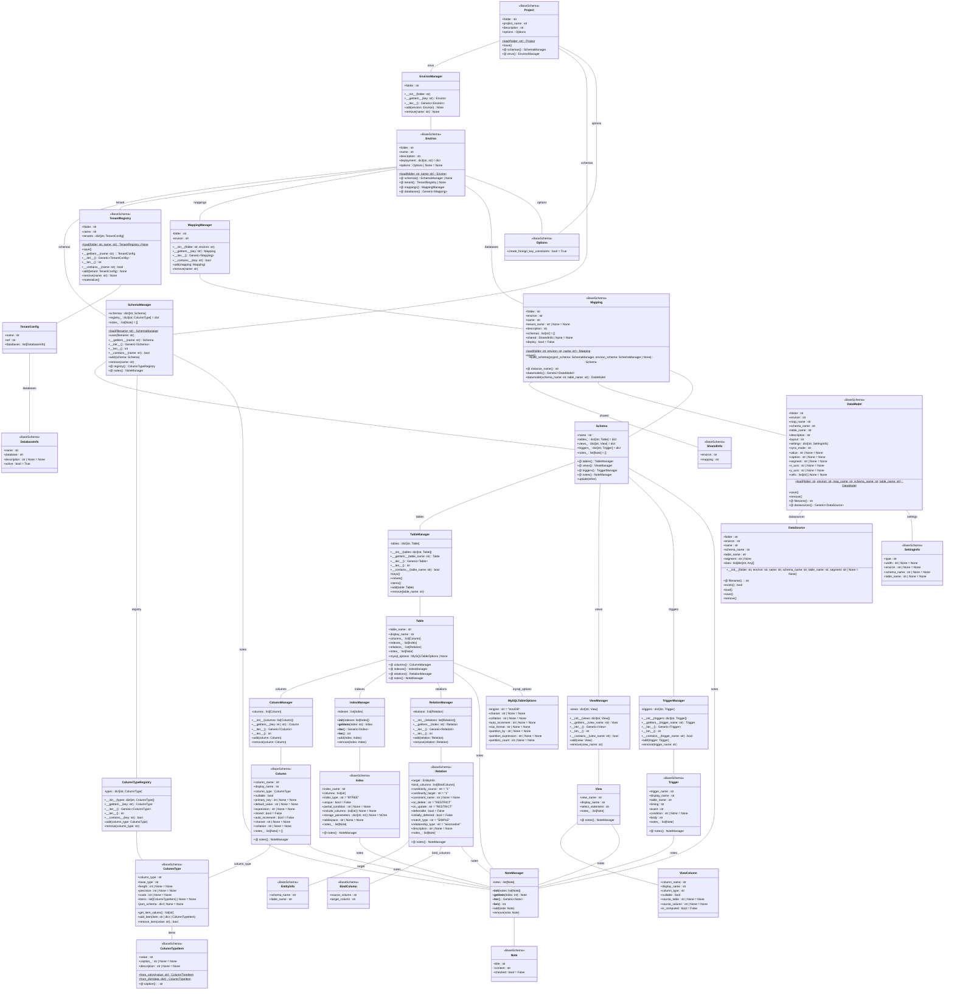

```mermaid
classDiagram
    class Column {
        <<BaseSchema>>
        +column_name : str
        +display_name : str
        +column_type : ColumnType
        +nullable : bool
        +primary_key : int | None = None
        +default_value : str | None = None

        +expression : str | None = None
        +stored : bool = False
        +auto_increment : bool = False
        +charset : str | None = None
        +collation : str | None = None
        +notes_ : list[Note] = []

        +@ notes() NoteManager
    }

    Column -- ColumnType : column_type
    Column -- NoteManager : notes

    class ColumnManager {
        -columns : list[Column]

        +\_\_init__(columns: list[Column])
        +\_\_getitem__(key: int | str) Column
        +\_\_iter__() Generic~Column~
        +\_\_len__() int

        +add(column: Column)
        +remove(column: Column)
    }

    ColumnManager -- Column

    class ColumnTypeItem {
        <<BaseSchema>>
        +value : str
        +caption_ : str | None = None
        +description : str | None = None
        +from_string(value: str) ColumnTypeItem$
        +from_dict(data: dict) ColumnTypeItem$

        +@ caption() : str
    }

    class ColumnType {
        <<BaseSchema>>
        +column_type : str
        +base_type : str
        +length : int | None = None
        +precision : int | None = None
        +scale : int | None = None
        +items : list[ColumnTypeItem] | None = None
        +json_schema : dict | None = None

        +get_item_values() list[str]
        +add_item(item: str | dict | ColumnTypeItem)
        +remove_item(value: str) bool
    }

    ColumnType -- ColumnTypeItem : items

    class ColumnTypeRegistry {
        -types : dict[str, ColumnType]

        +\_\_init__(types: dict[str, ColumnType])
        +\_\_getitem__(key: str) ColumnType
        +\_\_iter__() Generic~ColumnType~
        +\_\_len__() int
        +\_\_contains__(key: str) bool

        +add(column_type: ColumnType)
        +remove(column_type: str)
    }

    ColumnTypeRegistry -- ColumnType

    class SettingInfo {
        <<BaseSchema>>
        +type : str
        +width : int | None = None
        +environ : str | None = None
        +schema_name : str | None = None
        +table_name : str | None = None
    }

    class DataSource {
        +folder : str
        +environ : str
        +name : str
        +schema_name : str
        +table_name : str
        +segment : str | None
        +data : list[dict[str, Any]]

        +\_\_init__(folder: str, environ: str, name: str, schema_name: str, table_name: str, segment: str | None = None)

        +@ filename() : str

        +exists() bool
        +load()
        +save()
        +remove()
    }

    class DataModel {
        <<BaseSchema>>
        +folder : str
        +environ : str
        +map_name : str
        +schema_name : str
        +table_name : str
        +description : str
        +layout : str
        +settings : dict[str, SettingInfo]
        +sync_mode : str
        +value : str | None = None
        +caption : str | None = None
        +segment : str | None = None
        +x_axis : str | None = None
        +y_axis : str | None = None
        +cells : list[str] | None = None

        +load(folder: str, environ: str, map_name: str, schema_name: str, table_name: str) DataModel$
        +save()
        +remove()
        +@ filename() str
        +@ datasources() Generic~DataSource~
    }

    DataModel -- DataSource : datasources
    DataModel -- SettingInfo : settings

    class Environ {
        <<BaseSchema>>
        +folder : str
        +name : str
        +description : str
        +deployment : dict[str, str] = dict
        +options : Options | None = None

        +load(folder: str, name: str) Environ$

        +@ schemas() SchemaManager | None
        +@ tenant() TenantRegistry | None
        +@ mappings() MappingManager
        +@ databases() Generic~Mapping~
    }

    Environ -- SchemaManager : schemas
    Environ -- TenantRegistry : tenant
    Environ -- MappingManager : mappings
    Environ -- Mapping : databases
    Environ -- Options : options

    class EnvironManager {
        +folder : str

        +\_\_init__(folder: str)
        +\_\_getitem__(key: str) Environ
        +\_\_iter__() Generic~Environ~
        +add(environ: Environ) None
        +remove(name: str) None
    }

    EnvironManager -- Environ

    class Index {
        <<BaseSchema>>
        +index_name : str
        +columns : list[str]
        +index_type : str = "BTREE"
        +unique : bool = False
        +partial_condition : str | None = None
        +include_columns : list[str] | None = None
        +storage_parameters : dict[str, str] | None = NOne
        +tablespace : str | None = None
        +notes_ : list[Note]

        +@ notes() NoteManager
    }

    Index -- NoteManager : notes

    class IndexManager {
        -indexes : list[Index]

        +__init__(indexes: list[Index])
        +__getitem__(index: int) Index
        +__iter__() Generic~Index~
        +__len__() int

        +add(index: Index)
        +remove(index: Index)
    }

    IndexManager -- Index

    class SharedInfo {
        <<BaseSchema>>
        +environ : str
        +mapping : str
    }

    class Mapping {
        <<BaseSchema>>
        +folder : str
        +environ : str
        +name : str
        +tenant_name : str | None = None
        +description : str
        +schemas : list[str] = []
        +shared : SharedInfo | None = None
        +deploy : bool = False

        +load(folder: str, environ: str, name: str) Mapping$

        +save()
        +build_schema(project_schema: SchemaManager, environ_schema: SchemaManager | None) Schema

        +@ instance_name() str
        +datamodels() Generic~DataModel~
        +datamodel(schema_name: str, table_name: str) DataModel
    }

    Mapping -- SharedInfo : shared
    Mapping -- DataModel
    Mapping -- Schema

    class MappingManager {
        -folder : str
        -environ : str

        +\_\_init__(folder: str, environ: str)
        +\_\_getitem__(key: str) Mapping
        +\_\_iter__() Generic~Mapping~
        +\_\_contains__(key: str) bool

        +add(mapping: Mapping)
        +remove(name: str)
    }

    MappingManager -- Mapping

    class Note {
        <<BaseSchema>>
        +title : str
        +content : str
        +checked : bool = False
    }

    class NoteManager {
        -notes : list[Note]

        +__init__(notes: list[Note])
        +__getitem__(index: int) Note
        +__iter__() Generic~Note~
        +__len__() int

        +add(note: Note)
        +remove(note: Note)
    }

    NoteManager -- Note

    class Options {
        <<BaseSchema>>
        +create_foreign_key_constraints : bool = True
    }

    class Project {
        <<BaseSchema>>
        +folder : str
        +project_name : str
        +description : str
        +options : Options
        +load(folder: str) Project$
        +save()
        +@ schemas() SchemaManager
        +@ envs() EnvironManager
    }

    Project -- EnvironManager : envs
    Project -- SchemaManager : schemas
    Project -- Options : options

    class EntityInfo {
        <<BaseSchema>>
        +schema_name : str
        +table_name : str
    }

    class BindColumn {
        <<BaseSchema>>
        +source_column : str
        +target_column : str
    }

    class Relation {
        <<BaseSchema>>
        +target : EntityInfo
        +bind_columns : list[BindColumn]
        +cardinarity_source : str = "1"
        +cardinarity_target : str = "1"
        +constraint_name : str | None = None
        +on_delete : str = "RESTRICT"
        +on_update : str = "RESTRICT"
        +deferrable : bool = False
        +initially_deferred : bool = False
        +match_type : str = "SIMPLE"
        +relationship_type : str = "association"
        +description : str | None = None
        +notes_ : list[Note]

        +@ notes() NoteManager
    }

    Relation -- EntityInfo : target
    Relation -- BindColumn : bind_columns
    Relation -- NoteManager : notes

    class RelationManager {
        -relations : list[Relation]

        +\_\_init__(relations: list[Relation])
        +\_\_getitem__(index: int) Relation
        +\_\_iter__() Generic~Relation~
        +\_\_len__() int

        +add(relation: Relation)
        +remove(relation: Relation)
    }

    RelationManager -- Relation

    class Schema {
        +name : str
        +tables_ : dict[str, Table] = dict
        +views_ : dict[str, View] = dict
        +triggers_ : dict[str, Trigger] = dict
        +notes_ : list[Note] = []

        +@ tables() TableManager
        +@ views() ViewManager
        +@ triggers() TriggerManager
        +@ notes() NoteManager

        +update(other)
    }

    Schema -- TableManager : tables
    Schema -- ViewManager : views
    Schema -- TriggerManager : triggers
    Schema -- NoteManager : notes

    class SchemaManager {
        +schemas : dict[str, Schema]
        +registry_ : dict[str, ColumnType] = dict
        +notes_ : list[Note] = []

        +load(filename: str) SchemaManager$
        +save(filename: str)

        +\_\_getitem__(name: str) Schema
        +\_\_iter__() Generic~Schema~
        +\_\_len__() int
        +\_\_contains__(name: str) bool

        +add(schema: Schema)
        +remove(name: str)

        +@ registry() ColumnTypeRegistry
        +@ notes() NoteManager
    }

    SchemaManager -- Schema
    SchemaManager -- ColumnTypeRegistry : registry
    SchemaManager -- NoteManager : notes

    class MySQLTableOptions {
        +engine : str = "InnoDB"
        +charset : str | None = None
        +collation : str | None = None
        +auto_increment : int | None = None
        +row_format : str | None = None
        +partition_by : str | None = None
        +partition_expression : str | None = None
        +partition_count : int | None = None
    }

    class Table {
        +table_name : str
        +display_name : str
        +columns_ : list[Column]
        +indexes_ : list[Index]
        +relations_ : list[Relation]
        +notes_ : list[Note]
        +mysql_options : MySQLTableOptions | None

        +@ columns() ColumnManager
        +@ indexes() IndexManager
        +@ relations() RelationManager
        +@ notes() NoteManager
    }

    Table -- ColumnManager : columns
    Table -- IndexManager : indexes
    Table -- RelationManager : relations
    Table -- NoteManager : notes
    Table -- MySQLTableOptions : mysql_options

    class TableManager {
        -tables : dict[str, Table]

        +\_\_init__(tables: dict[str, Table])
        +\_\_getitem__(table_name: str) Table
        +\_\_iter__() Generic~Table~
        +\_\_len__() int
        +\_\_contains__(table_name: str) bool

        +keys()
        +values()
        +items()

        +add(table: Table)
        +remove(table_name: str)
    }

    TableManager -- Table

    class DatabaseInfo {
        <<BaseSchema>>
        +name : str
        +database : str
        +description : str | None = None
        +active : bool = True
    }

    class TenantConfig {
        +name : str
        +ref : str
        +databases : list[DatabaseInfo]
    }

    TenantConfig -- DatabaseInfo : databases

    class TenantRegistry {
        <<BaseSchema>>
        +folder : str
        +name : str
        +tenants : dict[str, TenantConfig]

        +load(folder: str, name: str) TenantRegistry | None$
        +save()

        +\_\_getitem__(name: str) : TenantConfig
        +\_\_iter__() Generic~TenantConfig~
        +\_\_len__() int
        +\_\_contains__(name: str) bool

        +add(tenant: TenantConfig) None
        +remove(name: str) None

        +materialize()
    }

    TenantRegistry -- TenantConfig

    class Trigger {
        <<BaseSchema>>
        +trigger_name : str
        +display_name : str
        +table_name : str
        +timing : str
        +event : str
        +condition : str | None = None
        +body : str
        +notes_ : list[Note]

        +@ notes() NoteManager
    }

    Trigger -- NoteManager : notes

    class TriggerManager {
        -triggers : dict[str, Trigger]

        +\_\_init__(triggers: dict[str, Trigger])
        +\_\_getitem__(trigger_name: str) Trigger
        +\_\_iter__() Generic~Trigger~
        +\_\_len__() int
        +\_\_contains__(trigger_name: str) bool

        +add(trigger: Trigger)
        +remove(trigger_name: str)
    }

    TriggerManager -- Trigger

    class ViewColumn {
        +column_name : str
        +display_name : str
        +column_type : str
        +nullable : bool
        +source_table : str | None = None
        +source_column : str | None = None
        +is_computed : bool = False
    }

    class View {
        +view_name : str
        +display_name : str
        +select_statement : str
        +notes_ : list[Note]

        +@ notes() NoteManager
    }

    View -- ViewColumn
    View -- NoteManager : notes

    class ViewManager {
        -views : dict[str, View]

        +\_\_init__(views: dict[str, View])
        +\_\_getitem__(view_name: str) View
        +\_\_iter__() Generic~View~
        +\_\_len__() int
        +\_\_contains__(view_name: str) bool

        +add(view: View)
        +remove(view_name: str)
    }

    ViewManager -- View

```
