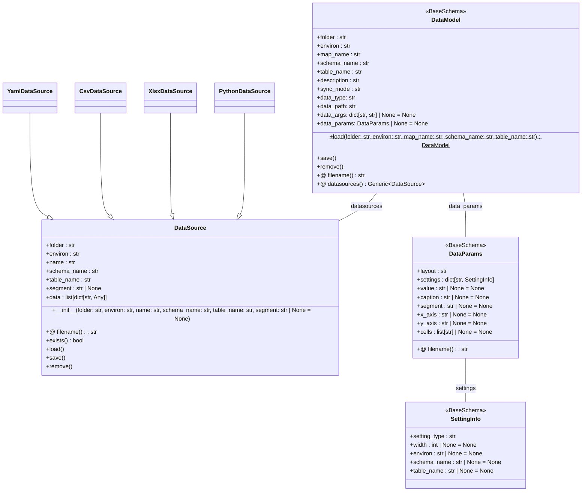

# データモデル定義

- データモデルは、DBGearプロジェクトの初期データを管理するための設定ファイルです。
- テーブル名をファイル名としたYAML形式のファイルで定義され、`DataModel`クラスで表現されます。
- データモデルは、スキーマ名、テーブル名、レイアウト種別、フィールド設定、同期モードなどを含みます。

## フォルダ構成

- *.yamlおよび*.datファイルがマッピングディレクトリに配置されます
  - *.yamlファイルは`{schema_name}@{table_name}.yaml`の形式で命名されます。
  - *.datファイルは`{schema_name}@{table_name}.dat`または`{schema_name}@{table_name}#{segment}.dat`の形式で命名されます。
- また、データソースはYAML以外にCSV、XLSX、Pythonスクリプトなどもサポートします。そのためファイルが存在しない可能性もあります。

```
project-root/
├── project.yaml          # プロジェクト設定ファイル
├── schema.yaml           # スキーマ定義ファイル
├── development/          # 環境ディレクトリ
│   ├── environ.yaml      # 環境設定ファイル
│   ├── schema.yaml       # 環境固有スキーマ（オプション）
│   ├── tenant.yaml       # テナント設定
│   ├── mapping1/         # マッピングディレクトリ
|   |  ├── _mapping.yaml  # マッピング設定
|   |  ├── *.yaml         # データモデル定義ファイル
|   |  ├── *.dat          # データファイル
│   ├── mapping2/         # マッピングディレクトリ
|   |  ├── _mapping.yaml  # マッピング設定
|....
```

## クラス構成図


