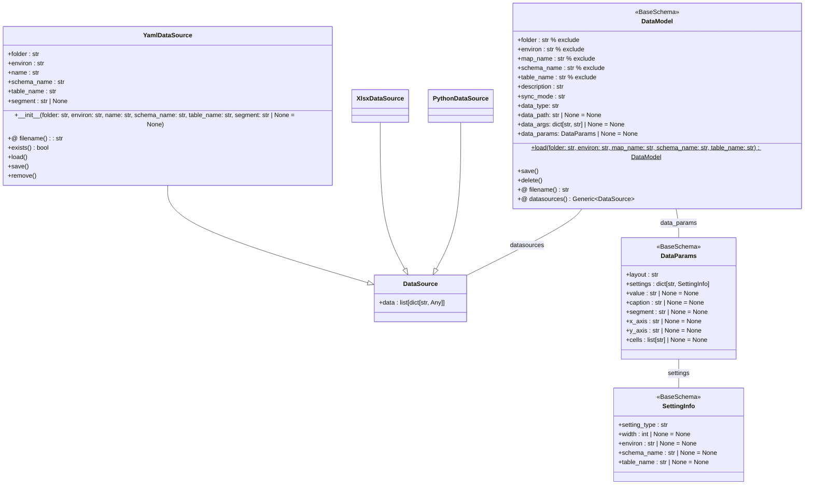

# データモデル定義

- データモデルは、DBGearプロジェクトの初期データを管理するための設定ファイルです。
- テーブル名をファイル名としたYAML形式のファイルで定義され、`DataModel`クラスで表現されます。
- データモデルは、スキーマ名、テーブル名、レイアウト種別、フィールド設定、同期モードなどを含みます。

## フォルダ構成

- *.yamlおよび*.datファイルがマッピングディレクトリに配置されます
  - *.yamlファイルは`{schema_name}@{table_name}.yaml`の形式で命名されます。
  - *.datファイルは`{schema_name}@{table_name}.dat`または`{schema_name}@{table_name}#{segment}.dat`の形式で命名されます。
- また、データソースはYAML以外にCSV、XLSX、Pythonスクリプトなどもサポートします。そのためファイルが存在しない可能性もあります。

```
project-root/
├── project.yaml          # プロジェクト設定ファイル
├── schema.yaml           # スキーマ定義ファイル
├── development/          # 環境ディレクトリ
│   ├── environ.yaml      # 環境設定ファイル
│   ├── schema.yaml       # 環境固有スキーマ（オプション）
│   ├── tenant.yaml       # テナント設定
│   ├── mapping1/         # マッピングディレクトリ
|   |  ├── _mapping.yaml  # マッピング設定
|   |  ├── *.yaml         # データモデル定義ファイル
|   |  ├── *.dat          # データファイル
│   ├── mapping2/         # マッピングディレクトリ
|   |  ├── _mapping.yaml  # マッピング設定
|....
```

## クラス構成図



## DataModelフィールド詳細

### 必須フィールド

#### description
- **型**: 文字列
- **説明**: データモデルの説明文

#### sync_mode（必須）
- **型**: 文字列
- **必須**: はい（デフォルト値なし）
- **取りうる値**:
  - `drop_create`: テーブル再作成時に初期データのみ投入、バックアップ復元なし
  - `manual`: 初期データ投入後、バックアップから新規レコードのみ追加（INSERT IGNORE）
  - `update_diff`: 初期データ投入後、バックアップから差分のあるレコードを更新・追加（REPLACE INTO）

**動作詳細**:

| sync_mode | 初期データ投入 | バックアップ復元 | 復元方式 | patch適用 |
|-----------|--------------|---------------|---------|----------|
| `drop_create` | ✓ | ✗ | - | ✗ |
| `manual` | ✓ | ✓（--patchがない場合） | INSERT IGNORE（新規のみ） | ✓（--patch指定時） |
| `update_diff` | ✓ | ✓（--patchがない場合） | REPLACE INTO（更新+新規） | ✓（--patch指定時） |

**復元方式の違い**:
- **INSERT IGNORE**: 既存レコードはスキップ、新規レコードのみ追加。初期データが優先される。
- **REPLACE INTO**: 既存レコードは削除して再挿入、新規レコードも追加。バックアップデータが優先される。

**注意**: v0.35.0以降、datamodel自体が定義されていない場合でも、`--patch`または`--restore-backup`オプションを使用することでデータ復元が可能です。

```bash
# datamodelなしでpatch適用（v0.35.0以降）
dbgear apply localhost development --target users --patch users.patch.yaml

# datamodelなしでバックアップ復元（v0.35.0以降）
dbgear apply localhost development --target users --restore-backup
```

#### data_type
- **型**: 文字列
- **説明**: データソースの種類
- **取りうる値**: `yaml`, `csv`, `xlsx`, `python` など

### オプションフィールド

#### data_path
- **型**: 文字列 | None
- **説明**: データファイルのカスタムパス

#### data_args
- **型**: ディクショナリ | None
- **説明**: データソース固有の引数

#### data_params
- **型**: DataParams | None
- **説明**: データレイアウトやセグメント情報

#### dependencies
- **型**: リスト[文字列]
- **説明**: データ投入順序の依存関係（`schema@table`形式）
- **例**: `["main@users", "main@categories"]`
