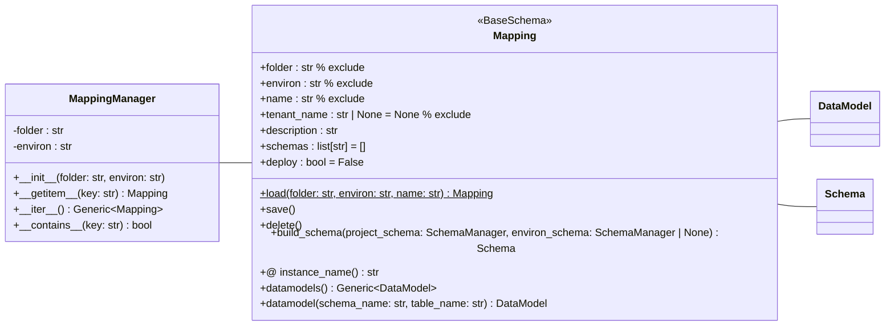

# データマッピング定義

- DBGearの環境毎のデータとのマッピングを定義します。
- マッピングは、スキーマとデータベースの関連付けを行い、初期データの管理を行います。
- データマッピングは`_mapping.yaml`ファイルで定義され、`MappingManager`クラスで表現されます。

## フォルダ構成

`_mapping.yaml`は各環境ディレクトリ内のマッピングサブディレクトリに配置します。

```
project-root/
├── project.yaml          # プロジェクト設定ファイル
├── schema.yaml           # スキーマ定義ファイル
├── development/          # 環境ディレクトリ
│   ├── environ.yaml      # 環境設定ファイル
│   ├── schema.yaml       # 環境固有スキーマ（オプション）
│   ├── tenant.yaml       # テナント設定（オプション）
│   ├── mapping1/         # マッピングディレクトリ
|   |  ├── _mapping.yaml  # マッピング設定（本ファイル）
|   |  ├── *.yaml         # データモデル定義ファイル
|   |  ├── *.dat          # データファイル
│   ├── mapping2/         # マッピングディレクトリ
|   |  ├── _mapping.yaml  # マッピング設定
|....
```

## クラス構成図



## サンプル

```yaml
description: Mapping description
schemas:
  - schema_name
deploy: true
```
