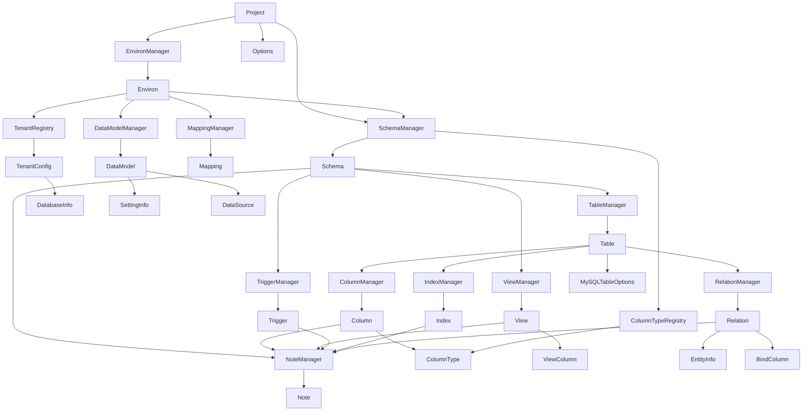

# DBGear コアモデル仕様書

## 概要

DBGearコアモデルは、データベーススキーマ管理のための包括的で型安全なデータモデルシステムを提供します。Pydanticベースで自動検証とシリアライゼーションを実現し、エンティティモデルとマネージャークラスによるCRUD操作を含む階層設計を採用しています。

## アーキテクチャ原則

- **Pydanticベース**: すべてのモデルが`BaseSchema`を継承し、自動検証とJSON/YAMLシリアライゼーションを提供
- **Managerパターン**: 各エンティティコレクションは専用のManagerクラスで管理
- **型安全性**: TypeScriptライクな完全な型ヒントとランタイム検証
- **YAML永続化**: camelCaseエイリアス付きYAMLベーススキーマストレージのネイティブサポート
- **MySQL重視**: 拡張可能なアーキテクチャでMySQLデータベース機能を主にサポート

## モデル関係図

## ファイル構造とクラス構成

### ベースアーキテクチャ

**base.py**
- `BaseSchema`: 全モデルの基底クラス。Pydantic BaseModelを継承し、camelCaseエイリアス生成と名前ベースフィールド解決をサポート

### プロジェクト管理

**project.py**
- `Project`: トップレベルプロジェクト設定コンテナ。環境とスキーマの統合管理を担当。共通オプション設定を含有

### スキーマ管理

**schema.py**
- `Schema`: テーブル、ビュー、トリガー、ノートを含むデータベーススキーマの表現
- `SchemaManager`: 複数スキーマの管理とYAML永続化。自動入力機能とカラムタイプレジストリを内包

### テーブル管理

**table.py**
- `Table`: データベーステーブルの定義。カラム、インデックス、リレーション、ノートを統合管理
- `TableManager`: テーブルコレクションの辞書ライクな管理インターフェース
- `MySQLTableOptions`: MySQL固有のテーブル設定（ストレージエンジン、パーティション、文字セット等）

### カラム管理

**column.py**
- `Column`: テーブルカラムの詳細定義。MySQL固有機能（AUTO_INCREMENT、生成カラム、文字セット）をサポート
- `ColumnManager`: カラムコレクションの配列ライク管理。名前とインデックス両方でのアクセスに対応

### カラムタイプシステム

**column_type.py**
- `ColumnType`: データベースカラムタイプの構造化表現。MySQL全タイプをサポート
- `ColumnTypeRegistry`: カスタムカラムタイプの登録・管理機能
- 解析・生成・検証ユーティリティ関数群

### ビュー管理

**view.py**
- `View`: SQL文ベースのデータベースビュー定義
- `ViewManager`: ビューコレクションの辞書ライク管理
- `ViewColumn`: 将来のSQL解析機能に対応したビューカラム定義

### トリガー管理

**trigger.py**
- `Trigger`: データベーストリガーの定義。実行タイミング、イベント、条件、処理内容を管理
- `TriggerManager`: トリガーコレクションの辞書ライク管理

### インデックス管理

**index.py**
- `Index`: 包括的なインデックス定義。PostgreSQL機能（部分インデックス、包含カラム）も含む
- `IndexManager`: インデックスコレクションの配列ライク管理

### リレーション管理

**relation.py**
- `Relation`: テーブル間のリレーションシップ定義。物理制約と論理関係を統合
- `RelationManager`: リレーションコレクションの配列ライク管理
- `EntityInfo`: テーブルエンティティへの参照情報
- `BindColumn`: 外部キーリレーションシップのカラムバインディング

### ノートシステム

**notes.py**
- `Note`: ドキュメントノート。レビュー追跡機能（checkedフラグ）を含む
- `NoteManager`: 全エンティティ統一のノート管理システム

### 環境管理

**environ.py**
- `Environ`: 環境設定コンテナ。スキーマ、テナント、マッピング設定の遅延読み込み。環境固有オプション設定を含有
- `EnvironManager`: 環境コレクションの管理

### マッピング管理

**mapping.py**
- `Mapping`: データ配備用のスキーママッピング設定
- `MappingManager`: 環境内のマッピングコレクション管理

### テナント管理

**tenant.py**
- `TenantConfig`: マルチテナント設定
- `TenantRegistry`: YAML永続化機能付きテナント設定レジストリ
- `DatabaseInfo`: テナント用のデータベース接続情報

### データ管理モデル

**datamodel.py**
- `DataModel`: Webインターフェース用のデータグリッドレイアウト設定
- `DataModelManager`: 環境内のデータモデルコレクション管理
- `DataSource`: テーブルデータのファイル管理（YAMLベース、セグメント化対応）
- `SettingInfo`: データ編集用のグリッドセル設定

### オプション管理

**option.py**
- `DBGearOptions`: プロジェクトと環境で共通利用されるオプション設定クラス
  - `create_foreign_key_constraints`: データベース構築時の外部キー制約作成制御
  - 将来的な拡張オプション（インデックス作成、データ整合性検証、トリガー有効化等）への対応準備

### 定数・例外

**const.py**
- レイアウトタイプ、バインディングタイプ、フィールドタイプ、同期モード等の定数定義

**exceptions.py**
- 統一された例外階層。DBGearError基底クラスから派生する各種例外クラス

## 設計思想

### エンティティとマネージャーの分離
各エンティティ（Schema、Table、Column等）は純粋なデータ保持クラスとして設計され、コレクション操作は対応するManagerクラスが担当します。これにより、単一責任原則を守りつつ、統一されたCRUD操作インターフェースを提供します。

### 型安全性の重視
ColumnTypeオブジェクトによる構造化された型管理、Pydanticによるランタイム検証、TypeScriptライクな型ヒントにより、設計時から実行時まで一貫した型安全性を実現しています。

### 段階的拡張への対応
MySQLを主要ターゲットとしながらも、PostgreSQL機能（部分インデックス等）や将来のSQL解析機能（ViewColumn）への対応準備を含む、拡張可能な設計を採用しています。

### ドキュメント統合
全エンティティ共通のNoteシステムにより、DB物理コメントとは独立した設計情報・レビュー情報の管理を実現しています。ノート情報はドキュメントとバージョン管理専用で、実際のSQL生成には含まれません。

### オプション駆動設計
プロジェクトレベルと環境レベルで共通のオプション設定システムを提供し、データベース構築の動作をきめ細かく制御できます。外部キー制約の生成制御など、運用要件に応じた柔軟な設定が可能です。

## YAMLシリアライゼーション

すべてのモデルはcamelCaseエイリアス付きYAMLシリアライゼーションをサポートし、Gitでの差分管理とバージョン管理に適した形式でデータを永続化します。

この設計により、包括的なデータベーススキーマ管理システムとして、開発者の生産性向上と保守性を両立させています。
