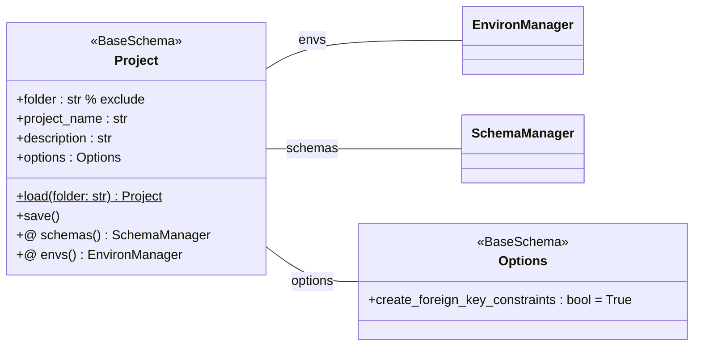

# プロジェクト定義

- DBGearにおけるデータを管理する単位をプロジェクトと定義します。
- プロジェクトは`project.yaml`ファイルで定義され、`Project`クラスで表現されます。
- プロジェクトクラスはフォルダパス、プロジェクト名、説明、およびオプションを含みます。
- プロジェクトは、スキーマおよび環境の管理を行います。

## フォルダ構成

`project.yaml`はプロジェクトのルートディレクトリに配置します。

```
project-root/
├── project.yaml          # プロジェクト設定ファイル（本ファイル）
├── schema.yaml           # スキーマ定義ファイル
├── development/          # 開発環境ディレクトリ
├── test/                 # テスト環境ディレクトリ
└── production/           # 本番環境ディレクトリ
```

## クラス構成図



## プロジェクトサンプル

```yaml
project_name: MyProject
description: Database initial data management
options:
    create_foreign_key_constraints: true
```
