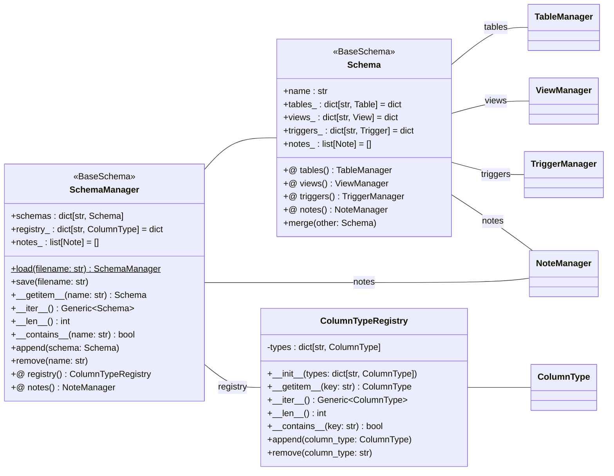
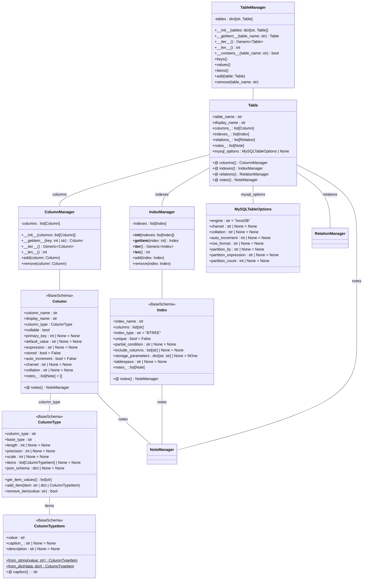
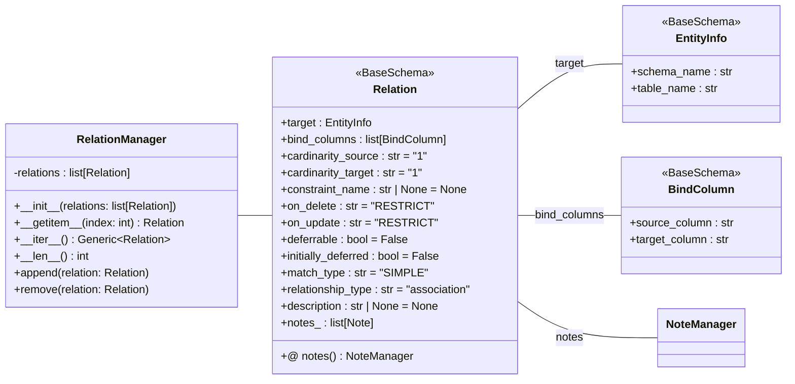
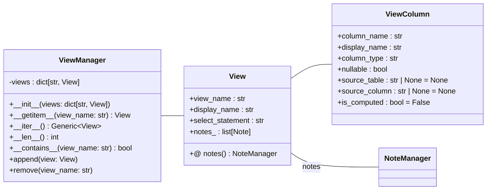
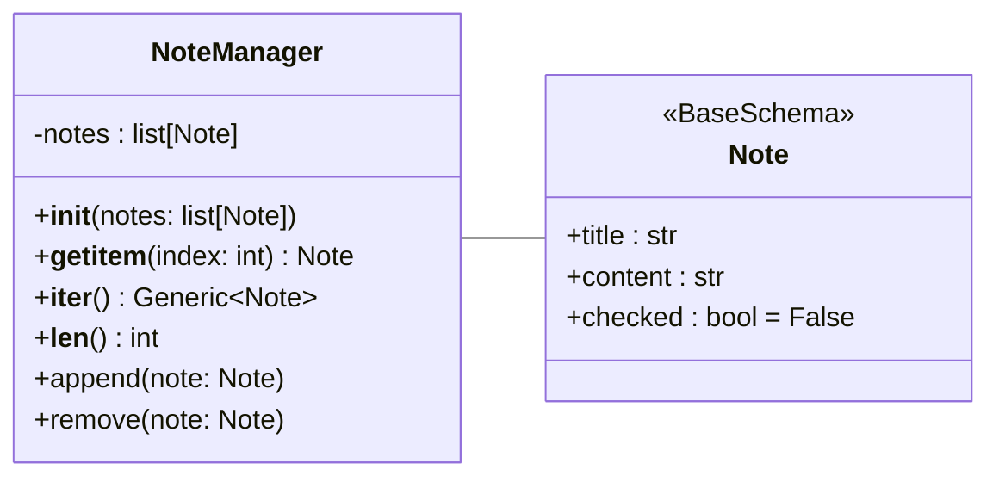
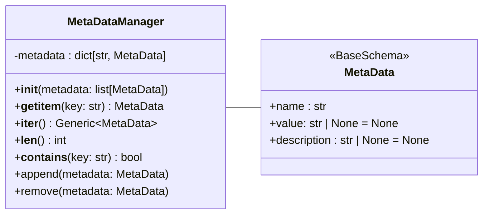

# スキーマ定義

- DBGearのデータベーススキーマ定義を管理するファイルです。
- テーブル、ビュー、トリガー、インデックス、リレーション、カラム型定義を包括的に管理し、DBGearの中核となるスキーマ情報を提供します。

## フォルダ構成

- `schema.yaml`はプロジェクトのルートディレクトリに配置します。
- また、環境ごとに異なるスキーマ定義が必要な場合は、各環境ディレクトリ内に`schema.yaml`を配置することもできます。

```
project-root/
├── project.yaml          # プロジェクト設定ファイル
├── schema.yaml           # スキーマ定義ファイル
├── development/          # 環境ディレクトリ
│   ├── environ.yaml      # 環境設定ファイル
│   ├── schema.yaml       # 環境固有スキーマ（オプション）
│   ├── tenant.yaml       # テナント設定
│   ├── mapping1/         # マッピングディレクトリ
|   |  ├── _mapping.yaml  # マッピング設定
|   |  ├── *.yaml         # データモデル定義ファイル
|   |  ├── *.dat          # データファイル
│   ├── mapping2/         # マッピングディレクトリ
|   |  ├── _mapping.yaml  # マッピング設定
|....
```

## クラス構成図

### スキーマ



### テーブル、カラム、インデックス



### リレーション



### ビュー



### トリガー

```mermaid
classDiagram
    direction LR

    class Trigger {
        <<BaseSchema>>
        +trigger_name : str
        +display_name : str
        +table_name : str
        +timing : str
        +event : str
        +condition : str | None = None
        +body : str
        +notes_ : list[Note]

        +@ notes() NoteManager
    }

    Trigger -- NoteManager : notes

    class TriggerManager {
        -triggers : dict[str, Trigger]

        +\_\_init__(triggers: dict[str, Trigger])
        +\_\_getitem__(trigger_name: str) Trigger
        +\_\_iter__() Generic~Trigger~
        +\_\_len__() int
        +\_\_contains__(trigger_name: str) bool

        +append(trigger: Trigger)
        +remove(trigger_name: str)
    }

    TriggerManager -- Trigger
````

## サンプル

```yaml
schemas:
  main:
    tables:
      table_name:
        # テーブル定義
    views:
      view_name:
        # ビュー定義
    triggers:
      trigger_name:
        # トリガー定義
```

## ノートおよびメタデータ管理

- スキーマ定義に関連するノートやメタデータを管理するためのクラスを提供します。
- ノートは、スキーマの各要素に関連するメモや説明を保持し、メタデータは視覚情報を管理します。


### ノート



### メタデータ


