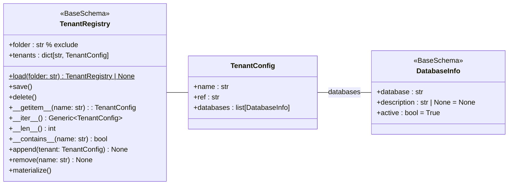

# マルチテナント定義

- データマッピングを拡張して、マルチテナントを定義します。
- `tenant.yaml`ファイルを使用して、データベース名を定義します。

## フォルダ構成

`tenant.yaml`はプロジェクトの各環境ディレクトリに配置します。

```
project-root/
├── project.yaml          # プロジェクト設定ファイル
├── schema.yaml           # スキーマ定義ファイル
├── development/          # 環境ディレクトリ
│   ├── environ.yaml      # 環境設定ファイル
│   ├── schema.yaml       # 環境固有スキーマ（オプション）
│   ├── tenant.yaml       # テナント設定（本ファイル）
│   ├── mapping1/         # マッピングディレクトリ
|   |  ├── _mapping.yaml  # マッピング設定
|   |  ├── *.yaml         # データモデル定義ファイル
|   |  ├── *.dat          # データファイル
│   ├── mapping2/         # マッピングディレクトリ
|   |  ├── _mapping.yaml  # マッピング設定
|....
```

## クラス構成図



## サンプル

```yaml
tenants:
  tenant_name:
    ref: reference_name
    databases:
      - database: db_name
        description: Optional description for the database
        active: true
```
